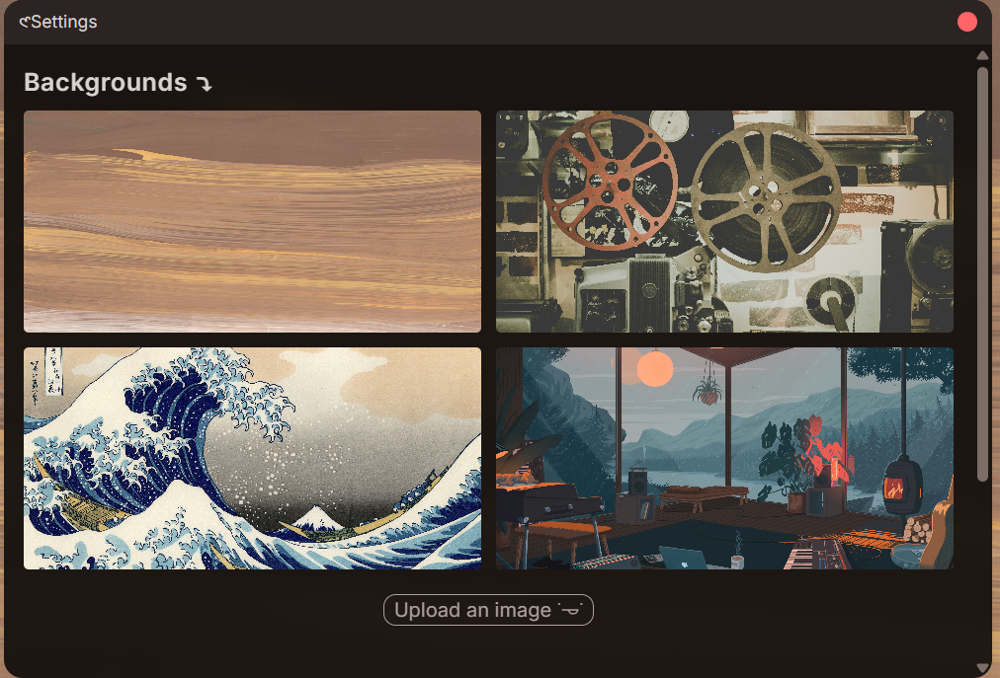
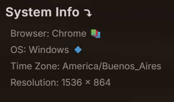
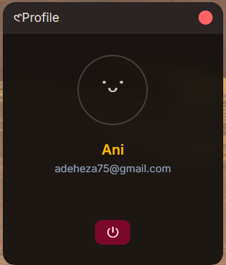
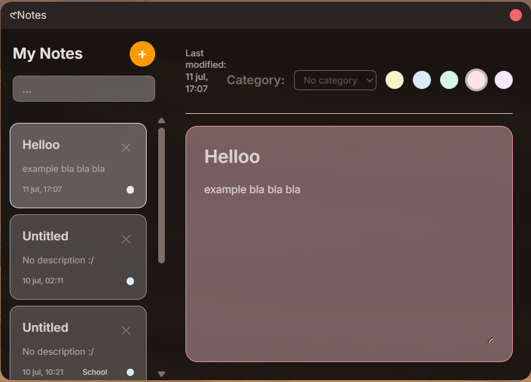
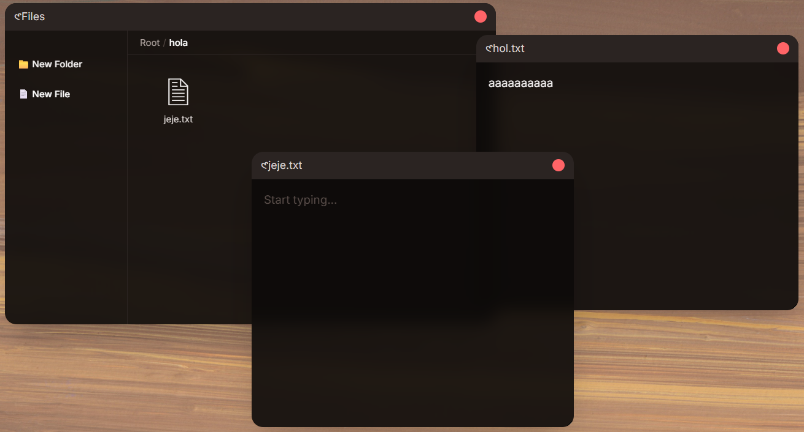
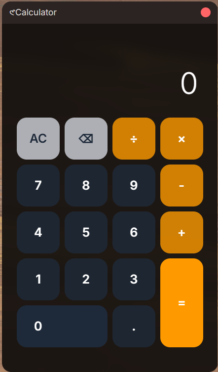
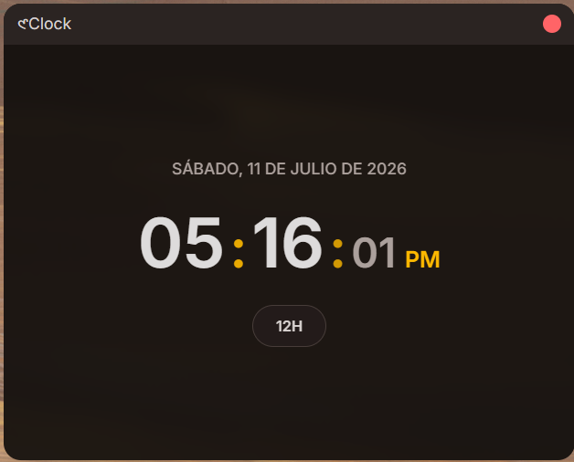

# MiniOS
MiniOS is a minimalist webOS with a few basic apps that i made to get more familiarized with coding the authentication by scratch, basic design, managing databases and learning to make basic app functions, using React + Typescript + Tailwind for the frontend and Express + Typescript for the backend.

## Lock
### Lock screen
Just a simple lock screen with time, day and a hint for nowing how to enter the webos

### Login/Signup
This is fully optional but you could create an account if you'd like to (this was mainly for applying my database and authentication knowledge, in some time i might add greater use to this)

    
    
    

If you do not provide a name you'll be refered as "guest" on the desktop

## Desktop
A simple desktop with a Dock that has apps and a top bar with utilities (time, weather, day, profile info and settings)

> in the top bar, settings and profile you can logout by pressing the "⏻" button

### Settings
Here you'll find:
- background changing options (and the posibility to add your own), it supports both images and video:
 

- your own system information:
 

### Profile
This window displays profile settings if any, you'll se the name you provided and your email (if you added any)

## Apps / Dock
### Notes
Just a simple note app where youu can add and delete your thoughts, to-dos, etc.

With optional tags (work, school, ideas, important), and optional colors to diferentiate your notes more easily.

### File Explorer
A basic file explorer where you can add and delete folders and text files, with an openeable window for writing your files, it works fully inside the webos, perhaps i'll add the option of downloading or adding other file extensions in the future.

### Calculator
A basic calculator, not much more to say :)

### Clock
literally just the hour, 12 / 24 hours format, i may add alarms, cronometer and international hours in the future. 

