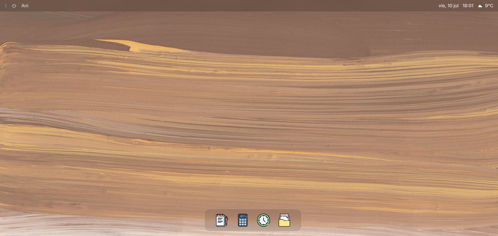
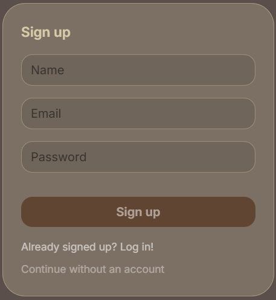
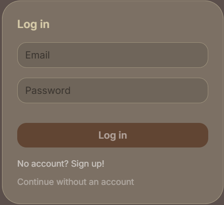
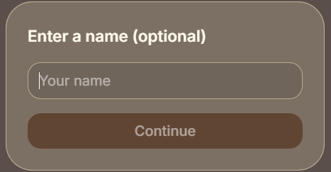

# MiniOS
MiniOS is a minimalist webOS with a few basic apps that i made to get more familiarized with coding the authentication by scratch, basic design, managing databases and learning to make basic app functions, using React + Typescript + Tailwind for the frontend and Express + Typescript for the backend.

## Features
### Lock screen
Just a simple lock screen with time, day and a hint for nowing how to enter the webos

### Login/Signup
This is fully optional but you could create an account if you'd like to (this was mainly for applying my database and authentication knowledge, in some time i might add greater use to this)

    
    
    

If you do not provide a name you'll be refered as "guest" on the desktop

### Settings
### Profile

## Apps 
### Notes
### File Explorer
### Calculator
### Clock

#### AI Use
> 